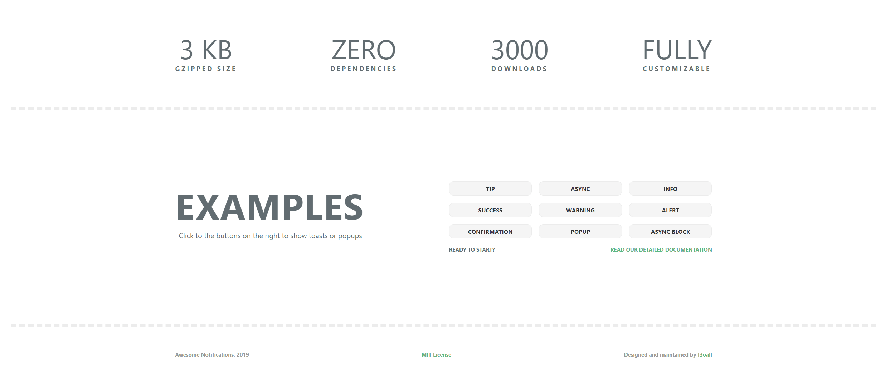

[](https://www.npmjs.com/package/awesome-notifications)
[](https://www.npmjs.com/package/awesome-notifications)
[](LICENSE)

# Awesome Notifications

It's a lightweight, fully customizable JavaScript library for showing notifications.

Advantages: **5kb gzipped size** &bull; **no dependencies**  &bull; **advanced async support**  &bull; **fully customizable**  &bull; **>95% test coverage**.

**Demo:** https://f3oall.github.io/awesome-notifications/

**Changelog:** [changelog.md](changelog.md)



## Install

> **Attention!** This library uses FontAwesome 4 icons, so you either need to make sure that [FontAwesome](https://fontawesome.com/v4.7.0/get-started/) is connected to your project or disable icons, passing the `icons: {enabled: false}` property to options. Also you can preserve icons setting up a custom template for them via editing `options.icons.prefix` and `options.icons.suffix`

**Via NPM**

```
npm install --save awesome-notifications
```

**In browser**

Download [index.var.js](dist/index.var.js) and [style.css](dist/style.css), then put them in your html:

```html
<head>
  <link rel="stylesheet" href="path/to/style.css"></link>
  <script src="path/to/index.var.js"></script>
</head>
```

**Vue.js version**

You can learn more in the Vue.js version repository: https://github.com/f3oall/vue-awesome-notifications

## Usage

**Node.js**

```javascript
import AWN from "awesome-notifications"

let notifier = new AWN(options)
```

**In browser**

```html
<script>
  var notifier = new AWN(options);
</script>
<button onclick="notifier.success('Success message');">Show Success</button>
```

**Available functions**

You can pass any valid HTML to `html` functions params.

| Function                                         | Params                                                                                                                                                                                                                                                  | Description                                                                                                  | Example                                                                                           |
| ------------------------------------------------ | ------------------------------------------------------------------------------------------------------------------------------------------------------------------------------------------------------------------------------------------------------- | ------------------------------------------------------------------------------------------------------------ | ------------------------------------------------------------------------------------------------- |
| `tip(html)`                                      | _html_ - `String`, required                                                                                                                                                                                                                             | shows a gray toast with specified `html`                                                                     | `tip('First line text<br>Second line text')`                                                      |
| `info(html)`                                     | _html_ - `String`, required                                                                                                                                                                                                                             | shows a blue toast with specified `html`                                                                     | `info('<b>You can put any HTML here</b>')`                                                        |
| `success(html)`                                  | _html_ - `String`, required                                                                                                                                                                                                                             | shows a green toast with specified `html`                                                                    | `success('Simple none-HTML message')`                                                             |
| `warning(html)`                                  | _html_ - `String`, required                                                                                                                                                                                                                             | shows an orange toast with specified `html`                                                                  | `warning('Simple none HTML message')`                                                             |
| `alert(html)`                                    | _html_ - `String`, required                                                                                                                                                                                                                             | shows a red toast with specified `html`                                                                      | `alert('Simple none HTML message')`                                                               |
| `async(promise, onResolve, onReject, html)`      | _promise_ - `Promise`, required; <br/> _onResolve_ - `Function`, `String`, optional, either callback or message; <br/> _onReject_ - `Function`, `String`, optional, either callback or message; <br/> _html_ - `String`, optional, html for async toast | shows an async gray toast untill `promise` will be completed, then run a callback or show new toast          | `async(somePromise, 'success toast msg', rejectCallback , 'Custom async msg')`                    |
| `asyncBlock(promise, onResolve, onReject, html)` | _promise_ - `Promise`, required; <br/> _onResolve_ - `Function`, `String`, optional, either callback or message; <br/> _onReject_ - `Function`, `String`, optional, either callback or message; <br/> _html_ - `String`, optional, html for async toast | shows loader and blocks the screen untill `promise` will be completed, then run a callback or show new toast | `asyncBlock(somePromise, resolveCallback, 'custom message for alert toast' , 'Custom async msg')` |
| `confirm(html, onOk, onCancel)`                  | _html_ - `String`, required <br/> _onOk_ - `Function`, optional <br/> _onCancel_ - `Function`, optional                                                                                                                                                 | shows a modal dialog, which is waiting for users confirmation                                                | `confirm('Are you sure?', runIfOkClicked, runIfCancelClicked)`                                    |
| `modal(html, className)`                         | _html_ - `String`, required <br/> _className_ - `String`, required                                                                                                                                                                                      | shows a custom modal dialog with which contains **only** value of `html`                                     | `modal('<h2>Your custom title</h2><p>Your custom text</p>', 'custom-class-name')`                 |

**How to use async**

There are two types of async functions in this library: `async` and `asyncBlock`. They differ in appearance but work with promises identically.

If your promise was rejected, alert toast will be shown to the user. New toast message will contain error returned by promise. **Make sure that error returned by promise has type of `string`**

Take a look on function behaviour after promise rejection:

```javascript
notifier.async(Promise.reject("some error")) // will show a new alert toast with message "some error"

notifier.async(Promise.reject({message: "some error")) // will throw an error, because returned value is Object.

notifier.async(Promise.reject("some error"), null, "custom error") // you can pass a string as `onResolve`, it will be used as message for alert toast

notifier.async(Promise.reject("some error"), null, err => console.log(err)) // you can pass a function as `onResolve`, no new toast will be added
notifier.async(Promise.reject("some error")).then(() => {},err => console.log(err)) // run same function with preserving new alert toast
```

If most of your promises returns similar objects, you can set `handleReject` function in options, to transform your objects to the strings:

```javascript
let notifier = new AWN({
  handleReject(value) {
    // value is returned value of your promises reject
    if (typeof value === "string") return value // optional check to preserve values which are already strings
    // any code which should be applied to all reject values
    return value.errors.message //choose string property of object that should be shown as error
  }
})
notifer.async(Promise.reject({ errors: { message: "custom message" } })) // there is no error anymore, alert toast will be shown.
```

If your promise was resolved, nothing will happen by default. Customization here is similar:

```javascript
notifier.async(Promise.resolve("all done")) // won't show anything after promise resolved

notifier.async(Promise.resolve("all done"), "your custom message") // will show a new success toast with message "your custom message"
notifier.async(Promise.resolve("all done"), result => {
  notifier.success(`${result} and your custom message`)
}) // will show a new success toast with message "all done and your custom message"
notifier.async(Promise.resolve("all done")).then(result => {
  notifier.success(`${result} and your custom message`)
}) // same as above, written without callback
```

**\*How to use modal**

`modal` function will create a new modal window with HTML that you provided. All your HTML will be put into the `div` with class `awn-modal-${className}`, where `className` is the second parameter in `modal` function.

## Customization

**Options**

You can pass your own options when you're initializing a library, e.g.

```javascript
var options = {
  labels: {
    tip: "Your custom tip box label"
  }
}
var notifier = new AWN(options)
```

**Available options**

All `labels` properties support HTML.

| Name                      | Type       | Default                               | Description                                                                                                                                                                                                                                                       |
| ------------------------- | ---------- | ------------------------------------- | ----------------------------------------------------------------------------------------------------------------------------------------------------------------------------------------------------------------------------------------------------------------- |
| position                  | `String`   | "bottom-right"                        | position of notifications                                                                                                                                                                                                                                         |
| duration                  | `Number`   | 5000                                  | determines how long notification exists, ms                                                                                                                                                                                                                       |
| animationDuration         | `Number`   | 300                                   | determines speed of animation, ms                                                                                                                                                                                                                                 |
| asyncBlockMinDuration     | `Number`   | 500                                   | minimal time to show asyncBlock modal window, prevents blinking, when async function completes too fast                                                                                                                                                           |
| maxNotifications          | `Number`   | 10                                    | max amount of notifications                                                                                                                                                                                                                                       |
| handleReject              | `Function` | [see in source code](src/defaults.js) | handles returned value of promise in async functions if it was rejected; <br> By default will throw an error, if value type isn't a `String`                                                                                                                      |
| labels                    | `Object`   | _See properties below_                | default labels for notifications                                                                                                                                                                                                                                  |
| _labels.tip_              | `String`   | "Tip"                                 | default label for tip toast                                                                                                                                                                                                                                       |
| _labels.info_             | `String`   | "Info"                                | default label for info toast                                                                                                                                                                                                                                      |
| _labels.success_          | `String`   | "Success"                             | default label for success toast                                                                                                                                                                                                                                   |
| _labels.warning_          | `String`   | "Attention"                           | default label for warning toast                                                                                                                                                                                                                                   |
| _labels.alert_            | `String`   | "Error"                               | default label for alert toast                                                                                                                                                                                                                                     |
| _labels.async_            | `String`   | "Loading"                             | default label for async toast                                                                                                                                                                                                                                     |
| _labels.confirm_          | `String`   | "Confirmation required"               | confrim window title                                                                                                                                                                                                                                              |
| icons                     | `Object`   | _See properties below_                | default Font Awesome icons for notifications                                                                                                                                                                                                                      |
| _icons.tip_               | `String`   | "question-circle"                     | FontAwesome icon classes for tip toast, first one without `fa-`                                                                                                                                                                                                   |
| _icons.info_              | `String`   | "info-circle"                         | FontAwesome icon classes for info toast, first one without `fa-`                                                                                                                                                                                                  |
| _icons.success_           | `String`   | "check-circle"                        | FontAwesome icon classes for success toast, first one without `fa-`                                                                                                                                                                                               |
| _icons.warning_           | `String`   | "exclamation-circle"                  | FontAwesome icon classes for warning toast, first one without `fa-`                                                                                                                                                                                               |
| _icons.alert_             | `String`   | "warning"                             | FontAwesome icon classes for alert toast, first one without `fa-`                                                                                                                                                                                                 |
| _icons.async_             | `String`   | "cof fa-spin"                         | FontAwesome icon classes for async toast, first one without `fa-`                                                                                                                                                                                                 |
| _icons.confirm_           | `String`   | "warning"                             | FontAwesome icon classes for confirm window, first one without `fa-`                                                                                                                                                                                              |
| _icons.enabled_           | `Boolean`  | `true`                                | Determines icons existence                                                                                                                                                                                                                                        |
| _icons.prefix_            | `String`   | `"<i class='fa fa-fw fa"`             | HTML before any `icons[value]` (e.g. `icons.tip`)                                                                                                                                                                                                                 |
| _icons.suffix_            | `String`   | `"'></i>"`                            | HTML after any `icons[value]` (e.g. `icons.tip`)                                                                                                                                                                                                                  |
| modal                     | `Object`   | _See properties below_                | modal windows settings                                                                                                                                                                                                                                            |
| _modal.okLabel_           | `String`   | "OK"                                  | confirm window success button label                                                                                                                                                                                                                               |
| _modal.cancelLabel_       | `String`   | "Cancel"                              | confirm window cancel button label                                                                                                                                                                                                                                |
| _modal.maxWidth_          | `String`   | "500px"                               | confirm window max-width CSS property                                                                                                                                                                                                                             |
| messages                  | `Object`   | _See properties below_                | default messages                                                                                                                                                                                                                                                  |
| _messages.async_          | `String`   | "Please, wait..."                     | default async toast message, supports HTML                                                                                                                                                                                                                        |
| _messages["async-block"]_ | `String`   | "Loading"                             | default asyncBlock modal message, supports HTML                                                                                                                                                                                                                   |
| replacements              | `Object`   | _See properties below_                | contains rules of replacement for `html`<br/>each rule is `Object`<br>where **keys** are first param for [replace function](https://developer.mozilla.org/en-US/docs/Web/JavaScript/Reference/Global_Objects/String/replace)<br/>and **values** are second param. |
| _replacements.general_    | `Object`   | `{ "<script>": "", "</script>": "" }` | rules for all event types                                                                                                                                                                                                                                         |
| _replacements.tip_        | `Object`   | `""`                                  | rules for tip events                                                                                                                                                                                                                                              |
| _replacements.info_       | `Object`   | `""`                                  | rules for info events                                                                                                                                                                                                                                             |
| _replacements.success_    | `Object`   | `""`                                  | rules for success events                                                                                                                                                                                                                                          |
| _replacements.warning_    | `Object`   | `""`                                  | rules for warning events                                                                                                                                                                                                                                          |
| _replacements.alert_      | `Object`   | `""`                                  | rules for alert events                                                                                                                                                                                                                                            |
| _replacements.async_      | `Object`   | `""`                                  | rules for async events                                                                                                                                                                                                                                            |
| _replacements.asyncBlock_ | `Object`   | `""`                                  | rules for asyncBlock modal window                                                                                                                                                                                                                                 |
| _replacements.modal_      | `Object`   | `""`                                  | rules for custom modal window                                                                                                                                                                                                                                     |
| _replacements.confirm_    | `Object`   | `""`                                  | rules for confirm window                                                                                                                                                                                                                                          |

**Styles**

The most convinient and quick way to change styles is dowload [styles](src/styles) folder which contains `.scss` files. Then you have to edit [variables.scss](src/styles/variables.scss), compile your `scss` to `css` and add new `css` file to your project.

Also, you can just add default `style.css` to your project and override it in your styles file. To learn more about default styles, look at [styles](src/styles) folder.

## Security notes

Make sure that you pass safe HTML to `msg` param. Sending data which can be directly or indirectly edited by user (e.g. name of account), provides a possibility for **HTML Injections**. You can set up `replacements` in options to filter `msg` variable.

## Browser support

Last 2 versions.

## License

This project is licensed under the terms of the [MIT license](LICENSE).
